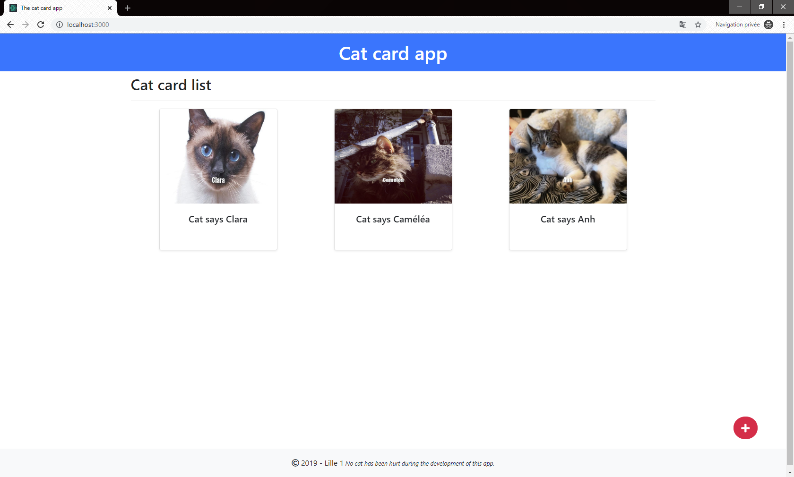

# Projet Lille 1 - Cat - Card

### Etudiantes : Caméléa Ouarkoub, Clara Verquerre et Thi-Ngoc-Anh TRAN

Ce projet a réalisé avec le framework ReactJs.

### Components : 
- `App` : contient le header et footer
- `Home` : est la page d'accueil, contient : 
    + la liste de cart qui sont définie en CatCard. 
    + un bouton d'ajouter le nouveau chat
    

    
    

- `CatCard` : une carte pour un chat, contient :
    + un titre, 
    + un url de l'image
    + une description.
    + un bouton pour modifier une carte de chat

- `Form` : est la page de formulaire, contient :
    + un loader
    

    
    

    
    + un input pour le titre
    + un input pour l'url de l'image
    + une description
    + un bouton supprimer
    + un bouton enregistrer

    

    
    

    

### Gestion des données : 
- les données et les fonctions asynchrones dans le fichier `data-service.js`.
- les components les importent pour afficher et gérer des données.
- un loader a été mis en place pour éviter que l'utilisateur modifie les champs qui sont en train d'attendre les données récupérées. Source : https://dribbble.com/shots/6321168-cat

